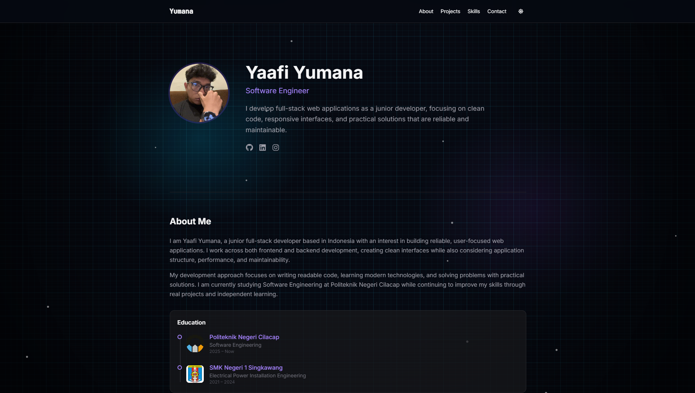

# Yaafi Yumana - Personal Portfolio

A clean, minimal, and interactive personal portfolio website showcasing my skills, projects, and experience as a Junior Full-Stack Developer. 

 <!-- Ganti screenshot nanti jika ada screenshot full page -->

## 🌟 Features

- **Dark & Light Mode:** Seamless theme switching with custom, highly interactive canvas backgrounds.
  - *Dark Mode:* Neon grid with drifting glow blobs, scanlines, and digital noise.
  - *Light Mode:* Soft, subtle layout with clean styling and reduced strain.
- **Micro-Interactions & Animations:** 
  - Scroll-triggered reveal animations powered by **Framer Motion**.
  - Interactive 3D tilt effects on project cards.
  - Custom canvas-based snow/particle system floating in the background.
  - Brand-colored hover reveals on the auto-scrolling tech stack marquees.
- **Fully Responsive:** Perfectly optimized for mobile, tablet, and desktop viewing.
- **Fast & Lightweight:** Built without heavy, unnecessary plugins. Prioritizes raw CSS capabilities and minimal dependencies.

## 💻 Tech Stack

- **Framework:** [React 19](https://react.dev/) + [Vite](https://vitejs.dev/)
- **Language:** [TypeScript](https://www.typescriptlang.org/)
- **Styling:** [Tailwind CSS v4](https://tailwindcss.com/) (using native CSS features and `@theme`)
- **Animation:** [Framer Motion](https://motion.dev/) & CSS Keyframes
- **Icons:** [React Icons](https://react-icons.github.io/react-icons/) (FontAwesome & SimpleIcons)

## 🚀 Running Locally

To run this project on your local machine:

1. **Clone the repository:**
   ```bash
   git clone https://github.com/YumanaHZ/portfolio.git
   cd portfolio
   ```

2. **Install dependencies:**
   ```bash
   npm install
   ```

3. **Start the development server:**
   ```bash
   npm run dev
   ```

4. Open your browser and visit `http://localhost:5173`.

## 📦 Building for Production

To build the app for production (generates a `dist` folder):
```bash
npm run build
```

## 🌐 Deployment

This project is easily deployable to [Vercel](https://vercel.com/) or [Netlify](https://www.netlify.com/). Simply connect your GitHub repository to your Vercel account, and it will automatically build and deploy the application.

---
*Crafted with ❤️ by Yaafi Yumana*
